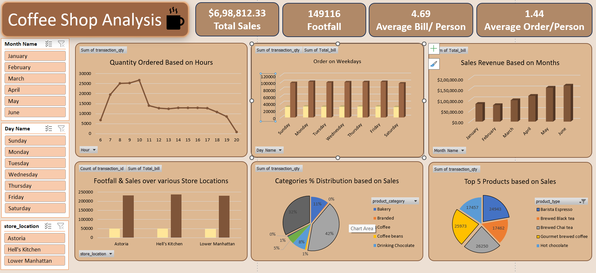

# ☕ Coffee Shop Sales Analysis Dashboard



## 📊 Project Overview

This project showcases an **interactive Excel dashboard** analyzing sales data from a multi-location coffee shop business. The aim is to derive **actionable insights** that enhance decision-making in areas such as product performance, customer behavior, and store operations.

### 🔍 Key Questions Addressed

* How do sales vary by **day of the week** and **hour of the day**?
* What are the **peak sales hours**?
* What is the **total sales revenue per month**?
* How does performance differ across **store locations**?
* What is the **average order and bill per person**?
* Which are the **top 5 best-selling products**?
* How are sales distributed across **product categories and types**?

---

## 🗂️ Dataset Description

The dataset used is included in this repository as:

📄 `coffee shop analysis (1).xlsx`

### Key Columns:

| Column Name        | Description                                    |
| ------------------ | ---------------------------------------------- |
| `transaction_id`   | Unique transaction identifier                  |
| `transaction_qty`  | Number of items sold in a transaction          |
| `Total_bill`       | Total amount paid per transaction              |
| `Hour`             | Hour of the day when the transaction occurred  |
| `Day Name`         | Day of the week (e.g., Monday, Tuesday)        |
| `Month Name`       | Month name (January to June)                   |
| `store_location`   | Location of the coffee shop branch             |
| `product_category` | Product category (e.g., Coffee, Bakery)        |
| `product_type`     | Specific product type (e.g., Barista Espresso) |

---

## 📈 Dashboard Highlights

The dashboard, built in **Excel**, features:

* **KPIs**:

  * 💵 Total Sales: `$6,98,812.33`
  * 👣 Total Footfall: `149,116`
  * 🧾 Average Bill/Person: `4.69`
  * ☕ Average Orders/Person: `1.44`

* **Sales Trends**:

  * Quantity ordered is highest between **8 AM and 10 AM**
  * Weekends show consistently higher transaction volume

* **Monthly Revenue Growth**:

  * Steady increase in sales from **January to June**, peaking in June

* **Store Performance**:

  * All three branches (Astoria, Hell's Kitchen, Lower Manhattan) perform similarly in terms of footfall and sales

* **Top 5 Products by Sales Quantity**:

  * 1. Gourmet Brewed Coffee – `26,250`
  * 2. Brewed Chai Tea – `25,973`
  * 3. Barista Espresso – `24,943`
  * 4. Hot Chocolate – `17,457`
  * 5. Brewed Black Tea – `17,462`

* **Category Distribution**:

  * Coffee dominates sales at `42%`, followed by Branded (`32%`), and Bakery (`11%`)

---

## 📁 Repository Contents

```
📦 Coffee-Shop-Sales-Analysis
├── 📊 coffee shop analysis (1).xlsx         # Raw dataset
├── 🖼️ Dashbaoard_image.png                  # Snapshot of the Excel dashboard
├── 📄 README.md                              # Project documentation
```

---

## ✅ Tools Used

* **Microsoft Excel** (Pivot Tables, Charts, Slicers, Dashboard Design)
* **Power Query** (if used for preprocessing)
* **Data Visualization** best practices

---

## 📌 How to Use

1. Open `coffee shop analysis (1).xlsx` in Excel.
2. Navigate to the **Dashboard** sheet.
3. Use the slicers to filter data by month, day, or store location.
4. Explore visual insights to understand sales trends and customer behavior.

---

## 📬 Contact

If you have any questions or suggestions, feel free to open an issue or reach out!


